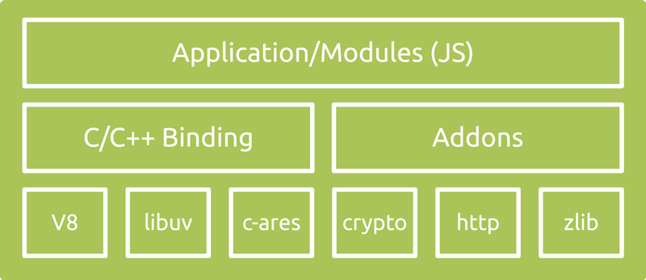
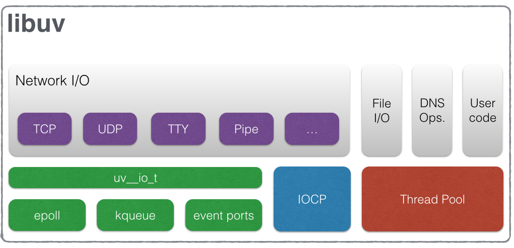

# 从Node.js到Node.cpp
C++事件驱动框架尝试之路

## 1. 什么是Node.js
* JS是脚本语言，脚本语言都需要一个解析器才能运行。对于写在HTML页面里的JS，浏览器充当了解析器的角色。而对于需要独立运行的JS，NodeJS就是一个解析器。
* Node.js框架使用事件驱动，非阻塞I/O模型而得以轻量和高效，非常适合在分布式设备上运行数据密集型的实时应用
影响
### 1.1 框架

* V8
  > Google 开源的高性能 JavaScript 引擎，以 C++ 实现。这也是集成在 Chrome 中的 JS 引擎。V8 将你写的 JavaScript 代码编译为机器码（所以它超级快）然后执行。
* libuv
  > 提供异步功能的 C 库。它在运行时负责一个事件循环（Event Loop）、一个线程池、文件系统 I/O、DNS 相关和网络 I/O，以及一些其他重要功能。
* 其他 C/C++ 组件和库
  > 如 c-ares、crypto (OpenSSL)、http-parser 以及 zlib。这些依赖提供了对系统底层功能的访问，包括网络、压缩、加密等。
* 应用/模块（Application/Modules）
  > 这部分就是所有的 JavaScript 代码：你的应用程序、Node.js 核心模块、任何 npm install 的模块，以及你写的所有模块代码。你花费的主要精力都在这部分。
* 绑定（Bindings）
  > Node.js 用了这么多 C/C++ 的代码和库，简单来说，它们性能很好。不过，JavaScript 代码最后是怎么跟这些 C/C++ 代码互相调用的呢？这不是三种不同的语言吗？确实如此，而且通常不同语言写出来的代码也不能互相沟通，没有 binding 就不行。Binding 是一些胶水代码，能够把不同语言绑定在一起使其能够互相沟通。在 Node.js 中，binding 所做的就是把 Node.js 那些用 C/C++ 写的库接口暴露给 JS 环境。这么做的目的之一是代码重用：这些功能已经有现存的成熟实现，没必要只是因为换个语言环境就重写一遍，如果桥接调用一下就足够的话。另一个原因是性能：C/C++ 这样的系统编程语言通常都比其他高阶语言（Python、JavaScript、Ruby 等等）性能更高，所以把主要消耗 CPU 的操作以 C/C++ 代码来执行更加明智。
* C/C++ Addons
  > Binding 仅桥接 Node.js 核心库的一些依赖，zlib、OpenSSL、c-ares、http-parser 等。如果你想在应用程序中包含其他第三方或者你自己的 C/C++ 库的话，需要自己完成这部分胶水代码。你写的这部分胶水代码就称为 Addon。可以把 Binding 和 Addon 视为连接 JavaScript 代码和 C/C++ 代码的桥梁。
### 1.2 特性
1. 单线程
   > Node没有创建线程的能力，所有代码都是单线程执行。不过Node宿主环境并不是单线程，它会维护一个执行队列
2. 事件轮询机制
   > 它可以在不新增额外线程的情况下，对任务进行并行处理，是通过事件轮询来实现的
3. 非阻塞I/O
   > 一个I/O操作通常会带有一个回调函数，当操作完成并返回时就会调用这个回调函数
### 1.3 现实比喻
mbp 曾经做过一个巧妙的比喻，把 Node.js 看成一家餐厅。我在此借用下他的例子，稍作修改来阐述下 Node.js 的执行情况：

把 Node.js 应用程序想象成一家星巴克，一个训练有素的前台服务生（唯一的主线程）在柜台前接受订单。当很多顾客同时光临的时候，他们排队（进入事件队列）等候接待；每当服务生接待一位顾客，服务生会把订单告知给经理（libuv），经理安排相应的专职人员去烹制咖啡（工作线程或者系统特性）。这个专职人员会使用不同的原料和咖啡机（底层 C/C++ 组件）按订单要求制作咖啡或甜点，通常会有四个这样的专职人员保持在岗待命（线程池），高峰期的时候也可以安排更多（不过需要在一早就安排人员来上班，而不能中午临时通知）。服务生把订单转交给经理之后不需要等着咖啡制作完成，而是直接开始接待下一位顾客（事件循环放进调用堆栈的另一个事件），你可以把当前调用堆栈里的事件看成是站在柜台前正在接受服务的顾客。

当咖啡完成时，会被发送到顾客队列的最后位置，等它移动到柜台前服务生会叫相应顾客的名字，顾客就来取走咖啡（最后这部分在真实生活中听起来有点怪，不过你从程序执行的角度理解就比较合乎情理了）。
### 1.4 为什么会成为当前最流行的开发语言
1. 开发效率高
   1. 基础框架接口完善，稳定
   2. 成熟的包管理机制，有海量现成的包可以直接使用，可避免重复造轮子
   3. 让开发者可以更多的关注于业务，而不用过多关心底层实现，代码自然就会简单易懂
2. 很容易写出性能高，稳定性强的代码
   1. 所有的IO操作都是异步的
   2. 有统一的异常捕获接口，中间某个操作出现异常，不会对下一次事件回调产生
   
## 2. 什么是libuv
* libuv是一个高性能的，事件驱动的I/O库，并且提供了跨平台（如windows, linux）的API
* libuv强制使用异步的，事件驱动的编程风格。它的核心工作是提供一个event-loop，还有基于I/O和其它事件通知的回调函数。libuv还提供了一些核心工具，例如定时器，非阻塞的网络支持，异步文件系统访问，子进程等。
### 2.1 框架

从架构图上看，libuv是对多个平台上的事件驱动异步I/O库进行了封装，如Linux下的epoll、FreeBSD下的kqueue、Solaris下的event ports、Windows下的IOCP。
### 2.2 核心：Event loops
在libuv事件编程模型中, 应用程序只是去监视特定的事件, 并在事件发生后对其作出响应。而收集事件或监控其他事件源则是libuv的职责, 编程人员只需要对感兴趣的事件去注册回调函数, 在事件发生后 libuv 将会调用相应的回调函数. 只要程序不退出并且还有待处理的事件, 事件循环会一直运行, 下面是事件驱动编程模型的伪代码:
```
while there are still events to process:
  e = get the next event
  if there is a callback associated with e:
      call the callback
```

## 3. Node.cpp
* 同样基于libuv
* 导出和Node.js基本一致的API，包括命名和使用方法，写代码可直接参考Node.js的API文档
* 内核的实现也是高度模仿Node原生内核的实现
### 3.1 为什么不直接使用Node.js
* 最新的Node.js已经不支持xp系统
* Node.js目前在前端容易遭到破解
* Node.js本身的尺寸较大，安装包在11M左右

## 4. Node.js/cpp示例
### 4.1 IPC通信
### 4.2 socket.io
### 4.3 快速搭建cgi测试框架

## 5. 常用库介绍


## 6. 更多兴趣点
1. Node.js(架构or常用库)
2. Node.cpp具体实现
3. Electron
4. React
5. React-Native
6. ES6 / ES7